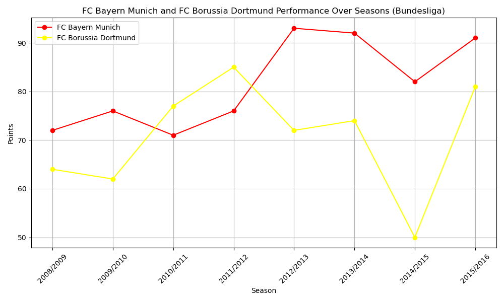
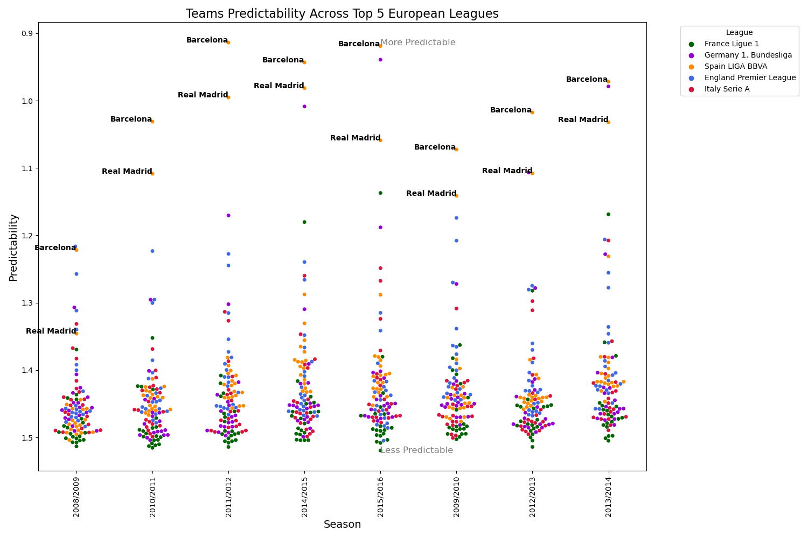

# Data-Driven Insights from Europe's Top 5 Leagues (2008–2016)

## 📌 Overview  
This project analyzes over 25,000 matches and 10,000 players across Europe’s top five football leagues between 2008 and 2016 using Python.  

- **Cleaned and transformed** a large Kaggle dataset for analysis across multiple leagues and seasons  
- **Investigated** key storylines such as Manchester United’s decline, PSG’s transformation, and Dortmund’s drop in form  
- **Evaluated** the role of defense in Serie A and dominance predictability in La Liga using advanced metrics  
- **Visualized** trends with Matplotlib and Seaborn to highlight key insights  
- **Delivered** actionable, data-driven insights into performance patterns of Europe’s most successful clubs  

---

## ⚙️ Tech Stack  
- **Python (Jupyter Notebook)**: Core analysis and scripting  
- **Pandas & NumPy**: Data cleaning, transformation, and manipulation  
- **Matplotlib & Seaborn**: Data visualization and exploratory analysis  
- **Kaggle Dataset**: Source data with 25K+ matches and 10K+ players  

---

## 🔑 Key Analyses  

### Premier League: Manchester United’s Decline  
- Compared performance metrics before and after Sir Alex Ferguson’s retirement  
- **Found** that United’s worst Ferguson-era season outperformed their best post-Ferguson season  

### Serie A: Defensive Prowess  
- Analyzed the correlation between **clean sheets** and league winners  
- **Revealed** whether defensive stability aligned with championship success  

### Ligue 1: PSG’s Transformation  
- Measured impact of the **QSI takeover (2011)** on PSG’s performance  
- **Showed** major improvements in wins, goals scored, and defensive strength post-investment  

### La Liga: Predictability of Dominance  
- Applied entropy (based on betting odds) to measure **predictability** of match outcomes  
- **Demonstrated** Real Madrid and Barcelona’s dominance through consistently low entropy values  

### Bundesliga: Dortmund’s Decline  
- Compared Bayern Munich and Borussia Dortmund’s points over multiple seasons  
- **Highlighted** Dortmund’s sharp decline after the 2011/12 peak seasons  

---

## 📊 Example Visualizations  

---

## 🚀 How to Use  
1. Download the dataset from Kaggle (https://www.kaggle.com/datasets/hugomathien/soccer).  
2. Place it in the `data/` folder.  
3. Open `europe_leagues_analysis.ipynb` in Jupyter Notebook.  
4. Run the notebook to reproduce the analysis and visualizations.  

---

## 📈 Insights Gained  
- Manchester United’s dominance faded post-Ferguson, with significant drops in points and goals scored  
- PSG transformed into a dominant force post-QSI takeover with improved offensive and defensive metrics  
- In Serie A, defensive strength (clean sheets) often aligned with title success  
- La Liga results showed strong predictability, with Barcelona and Real Madrid consistently dominant  
- Dortmund’s peak seasons were followed by sharp decline, while Bayern maintained steady supremacy  

---

## 📌 Learning Outcomes  
- Mastered **data cleaning and preparation** on large football datasets  
- Applied **statistical analysis** and advanced football metrics (e.g., entropy, clean sheets)  
- Built **clear, story-driven visualizations** with Matplotlib and Seaborn  
- Strengthened storytelling skills by linking raw data to real-world football narratives  

---

## 🔮 Future Enhancements  
- Extend analysis to **recent seasons (2016–2025)** for updated insights  
- Incorporate **expected goals (xG)** and other modern football analytics  
- Deploy results via **interactive dashboards (Tableau or Plotly Dash)**  
- Perform **predictive modeling** for forecasting league winners or player performance  

---
